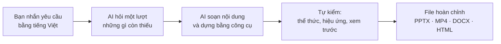

<div align="center">

# 2Anh Studio

**Trợ lý AI làm slide, video, tài liệu và văn bản bằng tiếng Việt — chỉ cần trò chuyện.**

[](https://github.com/luonghaianh1208/2anh-studio/releases/latest) [](https://github.com/luonghaianh1208/2anh-studio/stargazers) [](https://github.com/luonghaianh1208/2anh-studio/network/members) [](LICENSE) [](docs/vi/cai-dat-windows.md)

[Bắt đầu](#bắt-đầu-trong-3-bước) · [Làm được gì](#làm-được-gì) · [Điểm khác biệt](#điểm-khác-biệt) · [Tài liệu](#tài-liệu) · [Nhật ký thay đổi](CHANGELOG-VI.md)

</div>

Nhắn cho AI một câu như *"Làm bài giảng 12 slide về phản ứng oxi hoá – khử lớp 10"* hay *"Làm video kiểu Vox 60 giây về giao tiếp với đồng nghiệp"*, rồi nhận về file PowerPoint sửa được, video MP4 có giọng đọc tiếng Việt, giáo án Word hay công văn đúng thể thức. Không cần biết lập trình, không cần template.

*Trước đây là **PPT Master bản Việt**. Đổi tên vì bộ công cụ nay làm được nhiều hơn slide; link, câu lệnh và cách cập nhật cũ vẫn dùng được.*

Đây là bản Việt hoá, đóng gói và mở rộng của [PPT Master](https://github.com/hugohe3/ppt-master) (tác giả **Hugo He**, giấy phép MIT), do **Lương Hải Anh — 2Anh AI Education** thực hiện. Bản này thêm bộ cài một lần bấm cho Windows, quy tắc tiếng Việt cho AI, tài liệu tiếng Việt và các công cụ mới (video, giáo án, đề kiểm tra, thí nghiệm ảo, văn bản hành chính); phần lõi làm slide giữ nguyên dự án gốc.

> **Dành cho AI agent:** người dùng nhờ cài bộ công cụ này (hoặc chỉ dán link repo) thì làm theo [docs/vi/cai-dat-bang-ai.md](docs/vi/cai-dat-bang-ai.md), không tự nghĩ cách cài khác.

Phiên bản: **6.3.2-vi.15** · [Nhật ký thay đổi](CHANGELOG-VI.md)

## Video kiểu Vox, dựng từ một câu lệnh

<table>
  <tr>
    <td></td>
    <td></td>
    <td></td>
  </tr>
</table>

*Khung hình từ video 58 giây "Giao tiếp với đồng nghiệp": AI viết kịch bản, vẽ nền cắt dán cho từng cảnh qua API tạo ảnh, đọc bằng giọng Thu Giang, dựng xong trong khoảng 4–5 phút máy chạy.*

## Điểm khác biệt

| Điểm mạnh | Nghĩa là gì với bạn |
|---|---|
| 🗣️ **Nói tiếng Việt, hiểu việc của người Việt** | Câu lệnh tiếng Việt kích hoạt đúng công cụ; khổ Zalo, Facebook, TikTok; font hiển thị đủ dấu; giọng đọc tiếng Việt; công văn theo Nghị định 30 và chính quyền hai cấp từ 1/7/2025. |
| ✏️ **Slide sửa được, không phải ảnh dán** | Chữ, hình, biểu đồ là đối tượng PowerPoint thật. Muốn đổi một chữ thì bấm vào sửa, không phải làm lại cả bài. |
| ❓ **Hỏi trước một lượt, không đoán** | AI hỏi một lượt ngắn những gì còn thiếu (lớp, bộ sách, mục tiêu, đơn vị…) rồi mới làm, nên nội dung sát thực tế ngay lần đầu. |
| 🎬 **Video có hình khớp từng câu đọc** | Mỗi cụm lời gắn với một hình, thẻ hay con số; vật hiện đúng lúc giọng đọc nói tới. Video đúng thời lượng yêu cầu, có phụ đề karaoke. |
| 🛡️ **Không bịa** | Số liệu trong video phải có nguồn; văn bản hành chính thiếu số, ngày, người ký thì để ô `[CẦN BỔ SUNG]` chứ không tự điền; thí nghiệm ảo kiểm bằng bảng số trước khi giao. |
| 🔁 **Tự kiểm rồi mới giao** | Bộ kiểm thể thức cho văn bản, kiểm hiệu ứng cho slide, xem trước từng cảnh cho video. Hơn 1 600 test tự động giữ cho mỗi bản phát hành không làm hỏng bản trước. |
| 🖱️ **Cài một lần bấm** | Bấm đúp `CAI-DAT.bat` trên Windows, hoặc dán link repo cho AI tự cài. Cập nhật bằng `CAP-NHAT.bat`. |
| 🤝 **Dùng với AI bạn đang có** | Claude Code, Antigravity, Cursor, Codex: mở thư mục là AI đọc được quy tắc và công cụ. |

## Làm được gì



Hỏi thầy cô một lượt ngắn (môn, lớp, bộ sách, mục tiêu, đơn vị…) trước khi làm bài giảng, báo cáo, hoạt động Đoàn, poster và tập huấn, nên nội dung sát thực tế. Có 11 loại việc:

### 🖥️ Trình chiếu và ấn phẩm

- **Bài giảng, báo cáo – tổng kết, hoạt động Đoàn, tập huấn** ra PPTX từ PDF, Word, trang web, Markdown hoặc chỉ từ một chủ đề.
- **Poster Zalo – Facebook** ở khổ bài đăng 3:4, ảnh vuông, story 9:16; slide 16:9 và 4:3.
- **Hiệu ứng** theo mức chọn (không, vừa, nhiều): hiện từng ý khi bấm, bấm để hiện đáp án, Morph cho diễn biến thí nghiệm; bài có ảnh thật và sơ đồ thay vì toàn chữ.
- **Làm đẹp** lại một file PPTX có sẵn, và **thuyết minh** bằng giọng tiếng Việt.

### 🎬 Video

- **Video giải thích kiểu Vox** từ một chủ đề hay đoạn nội dung, cho mọi ngành: nền giấy cắt dán riêng cho từng cảnh, ảnh AI cắt rời, thẻ số liệu, chữ hiện đúng lúc giọng đọc nói tới, phụ đề karaoke, khổ ngang hoặc dọc Full HD.
- **Video bài giảng** từ slide đã có: gắn giọng đọc, phụ đề, giữ hoặc bỏ hiệu ứng chuyển cảnh.

### 📚 Dạy học

- Soạn **đề kiểm tra** KHTN/Vật lí/Hoá học/Sinh học bằng tiếng Anh, từ đề tiếng Việt có sẵn hoặc từ đầu, xuất ra file Word.
- Soạn **giáo án** kế hoạch bài dạy theo Công văn 5512, tích hợp năng lực số và năng lực AI, xuất ra file Word.
- Tạo **thí nghiệm ảo** Toán, Vật lí, Hoá học: một file HTML chạy không cần mạng, có bảng số liệu, đồ thị và phiếu học tập Word; 8 mô hình đã kiểm bằng số.

### 🏛️ Văn bản hành chính

- Soạn **văn bản hành chính** (công văn, tờ trình, quyết định, thông báo, giấy mời, biên bản…) ra file Word đúng thể thức Nghị định 30, có bộ kiểm thể thức; thông tin chưa có để ô cần bổ sung, không tự bịa.

## Bắt đầu trong 3 bước

1. **Tải về.** Bấm **Code → Download ZIP** rồi giải nén, hoặc dùng Git:
   ```
   git clone https://github.com/luonghaianh1208/2anh-studio.git
   ```
   Tải bằng Git thì sau này cập nhật chỉ bằng một cú bấm.
2. **Cài đặt.** Bấm đúp **`CAI-DAT.bat`**. Bộ cài kiểm tra Python, cài thư viện, tạo file cấu hình và xuất thử một file PPTX. Chi tiết: [Cài đặt trên Windows](docs/vi/cai-dat-windows.md).
3. **Nhắn việc cho AI.** Mở thư mục này trong Claude Code, Cursor hoặc Antigravity rồi nhắn, ví dụ `Tạo bài thuyết trình 10 slide giới thiệu trường THPT`. Xem [Bắt đầu nhanh](docs/vi/bat-dau-nhanh.md) và [Câu lệnh mẫu](docs/vi/cau-lenh-mau.md).

Dùng Antigravity và muốn AI làm hết: mở một thư mục trống rồi dán câu lệnh mẫu trong [Bắt đầu nhanh](docs/vi/bat-dau-nhanh.md#để-ai-tự-cài), AI tự tải, tự cài và báo khi sẵn sàng.

macOS/Linux: chạy `sh tools/vi/setup.sh`.

### Câu lệnh để thử ngay

| Muốn có | Nhắn cho AI |
|---|---|
| Bài giảng | `Làm bài giảng 12 slide về phản ứng oxi hoá – khử, Hoá 10` |
| Poster | `Làm poster Zalo thông báo họp phụ huynh tối thứ Sáu` |
| Video | `Làm video kiểu Vox 60 giây về cách quản lý thời gian` |
| Giáo án | `Soạn kế hoạch bài dạy Bài 5 Ammonia, tích hợp năng lực số` |
| Thí nghiệm ảo | `Làm thí nghiệm ảo con lắc đơn cho lớp 11` |
| Công văn | `Soạn công văn cử giáo viên đi tập huấn chuyển đổi số` |

## Ba file bấm đúp

| File | Khi nào dùng |
|---|---|
| `CAI-DAT.bat` | Lần đầu cài đặt, hoặc khi được hướng dẫn cài lại |
| `KIEM-TRA.bat` | Kiểm tra máy đã sẵn sàng chưa, khi gặp lỗi |
| `CAP-NHAT.bat` | Lấy phiên bản mới nhất (chỉ với bản tải bằng Git) |

## Tài liệu

| Tài liệu | Nội dung |
|---|---|
| [Cài đặt trên Windows](docs/vi/cai-dat-windows.md) | Cài Python, tải bộ công cụ, đọc kết quả kiểm tra |
| [Bắt đầu nhanh](docs/vi/bat-dau-nhanh.md) | Từ lúc cài xong đến file PPTX đầu tiên |
| [Câu lệnh mẫu](docs/vi/cau-lenh-mau.md) | Câu lệnh cho bài giảng, báo cáo, poster, thuyết minh |
| [Xử lý lỗi](docs/vi/xu-ly-loi.md) | Lỗi thường gặp và cách sửa |
| [Lấy API key](docs/vi/lay-api-key.md) | Bật tạo ảnh bằng AI |
| [Soạn đề tiếng Anh](docs/vi/soan-de-tieng-anh.md) | Từ đề tiếng Việt hoặc từ đầu, ra ba file Word (hai file nếu không cần bản song ngữ) |
| [Soạn giáo án](docs/vi/soan-giao-an.md) | Kế hoạch bài dạy 5512 tích hợp năng lực số và AI |
| [Làm thí nghiệm ảo](docs/vi/thi-nghiem-ao.md) | File HTML tương tác chạy không cần mạng, kèm phiếu học tập |
| [Làm video giải thích](docs/vi/video-giai-thich.md) | Video kiểu Vox có giọng đọc, ảnh AI và phụ đề, dựng từ một chủ đề |
| [Soạn văn bản hành chính](docs/vi/van-ban-hanh-chinh.md) | Công văn, tờ trình, quyết định… ra Word đúng thể thức Nghị định 30 |

Tài liệu gốc (tiếng Anh) của dự án nằm trong [docs/](docs/).

## Cập nhật

- Bản tải bằng Git: bấm đúp `CAP-NHAT.bat`.
- Bản ZIP: tải bản mới rồi chép thư mục `projects\` và file `.env` của bạn sang.
- Từng dùng bản cũ (v2): thư mục `examples/` đã được gỡ bỏ, bộ ví dụ xem tại https://github.com/hugohe3/ppt-master-examples; trạng thái bản cũ vẫn giữ ở tag `v2-vi-legacy`. Chi tiết trong [Nhật ký thay đổi](CHANGELOG-VI.md).

## Lượt sao theo thời gian

Thấy bộ công cụ có ích thì bấm ⭐ ở đầu trang để nhiều thầy cô và đồng nghiệp tìm thấy hơn.

<a href="https://star-history.com/#luonghaianh1208/2anh-studio&Date">
  <picture>
    <source media="(prefers-color-scheme: dark)" srcset="https://api.star-history.com/svg?repos=luonghaianh1208/2anh-studio&type=Date&theme=dark">
    
  </picture>
</a>

## Giấy phép & Ghi công

- Lõi PPT Master: © 2025-2026 Hugo He, giấy phép MIT — [LICENSE](LICENSE). Nhà tài trợ của dự án gốc: [SPONSORS.md](skills/ppt-master/SPONSORS.md).
- Phần Việt hoá và đóng gói: Lương Hải Anh — 2Anh AI Education, giấy phép MIT. Chi tiết: [NOTICE](NOTICE).
- ND30 — © 2026 Nguyễn Minh Phát, MIT (tools/vi/nd30): bộ sinh và bộ kiểm văn bản hành chính theo Nghị định 30, nhúng nguyên trạng từ https://github.com/kanazawahere/nd30. Giấy phép: [tools/vi/nd30/LICENSE](tools/vi/nd30/LICENSE); nguồn và SHA-256: [tools/vi/nd30/NGUON.md](tools/vi/nd30/NGUON.md).
- Bộ ví dụ của dự án gốc: https://github.com/hugohe3/ppt-master-examples
